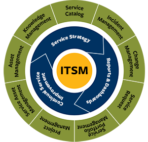

---
- [**Introduction**](#introduction)
- [**What is IT Service Management (ITSM)?**](#what-is-it-service-management-itsm)
- [**What specifically are these 'IT services' that IT teams manage?**](#what-specifically-are-these-it-services-that-it-teams-manage)

---

## **Introduction**

1. ITSM is  how IT teams manage the end-to-end delivery of IT services to their customers.
2. It includes all the processes and activities to design, create, deliver, and support IT services.
3. The core concept of ITSM is the belief that IT should be delivered as a service.
4. A typical ITSM scenario could involve asking for new hardware like a laptop. You would submit your request through a portal, filling out a ticket with all relevant information, and kicking off a repeatable workflow. Then, the ticket would land in the IT team’s queue, where incoming requests are sorted and addressed according to importance.

---

## **What is IT Service Management (ITSM)?**

People often misconstrue ITSM as basic IT support. On the contrary, ITSM teams oversee all kinds of workplace technologies, ranging from laptops to servers to business-critical software applications and Cloud services.

---

## **What specifically are these 'IT services' that IT teams manage?**

Think about a service as something that IT provides and supports for the business. It can be either external or internal facing.

1. _External examples_: Online banking, food delivery or streaming services.
2. _Internal examples:_ A billing system, HR system, or cloud infrastructure.

It can change based on how the business works, and how IT is structured within that organizations.